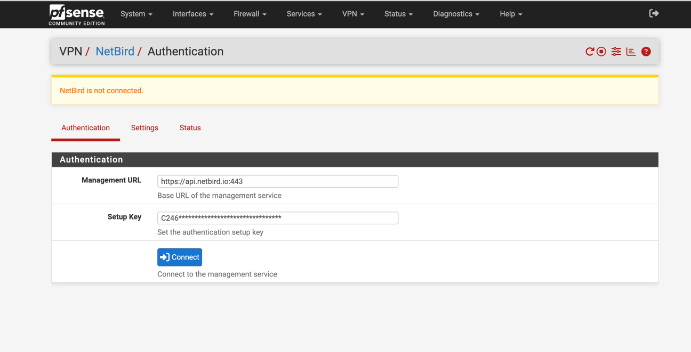

# NetBird Package for pfSense



## Build Instructions

Use **FreeBSD 15.0-CURRENT** as your base system for building the package.

### Steps:

```
git clone git@github.com:netbirdio/pfsense-netbird.git
cd pfSense-pkg-NetBird/
make
make package
```

The `make package` command will generate a file like:

```
/work/pkg/pfSense-pkg-NetBird-<version>.pkg
```

You can then transfer this file to your pfSense system and install it manually.

## Installation on pfSense

To install the package manually on pfSense:

```
pkg add netbird-<version>.pkg

pkg add -f pfSense-pkg-NetBird-<version>.pkg
```

Once installed, **NetBird** will appear under the **VPN** menu in the pfSense Web UI.